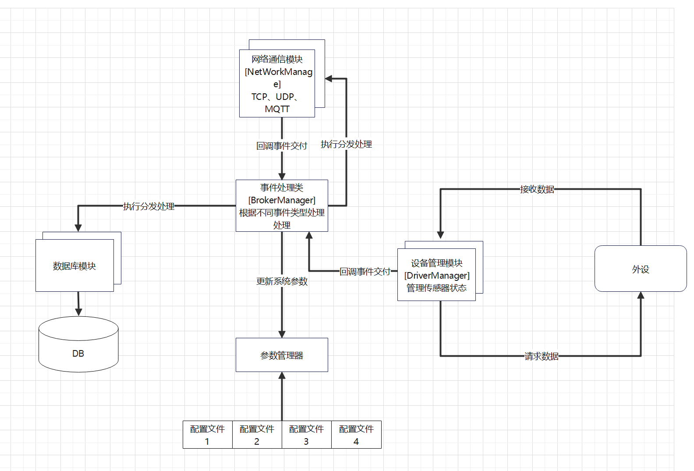

# 项目概述
### 项目文件结构
``` DIR
|--     CPPToolBox
    |-- CMakeLists.txt
    |-- LICENSE
    |-- README.md
    |-- format.bash
    |-- src       
    |   |-- base  
    |   |-- driver
    |   |-- db
    |   |-- event
    |   |-- net
```

## 项目介绍
### 系统架构
项目 参考很多开源项目,做到了整体解耦 



 上图是整个系统架构的一个简单概括性图示.
### 项目构建

使用**CMake**构建本项目.
当您在项目的根路径时, 可以执行以下指令:

+ aarch64 on ubuntu 18.04
```console
$ cd cpp-tools-box
$ mkdir build && cd build
$ cmake .. -DCMAKE_TOOLCHAIN_FILE=./cmake/toolchain_aarch64.cmake  -DCMAKE_INSTALL_PREFIX=/path/to/installation/dir ..
$ make 
$ make install 
则可以将库安装到指定目录
```

### 用例展示

#### 日志模块
宏定义有四个级别的日志记录:
+ `CLOG_DEBUG`
+ `CLOG_INFO`
+ `CLOG_WARN`
+ `CLOG_ERROR`

本模块提供两种风格的API日志输出方式
创建日志流匿名类的方式实例化日志流对象，在其析构时输出到控制台 并将日志内容输入到文件,日志模块格式如下
```CPP

CLOG_INFO() << "This is C++ Style INFO Log";
CLOG_INFO_FMT("%s","This is C Style INFO Log");

//Terminal
[1970.01.01-09:49:56][ INFO ][function][line] This is C++ Style INFO Log
[1970.01.01-09:49:56][ INFO ][function][line] This is C Style INFO Log

```
#### Eventloop(事件循环池)
底层使用IO多路复用epoll 传统**Reactor模型多线程响应式架构**
内部通过事件回调 执行相关任务配合ThreadPool可以进行大量计算和阻塞操作
```CPP
//向标准输入流 注册一个FD读事件
EpollLoop loop = Loop::New()
auto fds = loop->creatFdEvent("STDIO");
//初始化
fds->initialize(STDIN_FILENO,1,Event::Mode::kPersist);
//注册回调
fds->setReadCallback([&](int fd){
    char buffer[256];
    bzero(buffer, sizeof(buffer));
    read(STDIN_FILENO, buffer, sizeof(buffer));
    std::cout << buffer << std::endl;
});
//使能读取
fds->enableReading();
//开启事件循环等待相应
loop.runloop();
```
#### Device(外设模块)
```CPP
//创建一个串口模块 
uart1 = IODevice::creatSerialDevice(loop_,"UART1");

//初始化串口
if(uart1->init("/dev/ttyS4")) 
{
    //设置接收回调
    uart1->setReadCallback([](const char *data, int dataLen){
            ByteBuf buf(data,dataLen);
            std::cout << buf.data() << "  "<< dataLen  <<std::endl;
            //将接收的数据写会串口
            uart1->send(buf.data(),dataLen);
    });
}
uart1->start();
```
#### Timer(定时器)
``` CPP
//开启一个两秒触发一次的定时器
Timer  *timeTest = new Timer(loop_,"Timer");
timeTest->init(std::chrono::milliseconds(2000),std::chrono::milliseconds(2000));
        timeTest->setTimerCallback([](){
        CLOG_INFO()<< "Timer On Time";
});
timeTest->start();
```
#### TCP客户端

```CPP
  TcpClient *client = new TcpClient(loop_);
  Address address("192.168.16.231", 2345);
  client->init(address2);
  client->setConnectCallback([=](const std::shared_ptr<TcpConnection> &conn) {
    CLOG_INFO() << "Connected";
  });

  client->setReceiveCallback(
      [=](const std::shared_ptr<TcpConnection> &conn, void *data, ssize_t n) {
        char buffer[256];
        bzero(buffer, 256);
        memcpy(buffer, (char *)data, n);
        CLOG_INFO() << "Client recv: " << buffer;
        conn->send(buffer, n);
      });
  client->setCloseCallback([](std::shared_ptr<TcpConnection> conn) {
    CLOG_INFO() << "CLOSE!!!!!!";
  });
  client->start();

```


